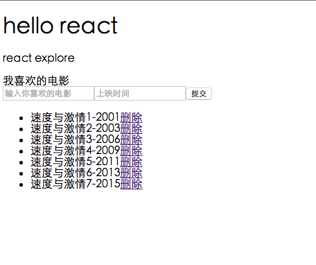

#Hello-react

---
```
学习react，写了一些demo
以下会一一介绍
react基本知识点都写在注释中
```

##demo0

- 实现了一个电影列表和表单提交
- 位置：hello-react/demo/demo0
- 在浏览器打开 http://localhost:63342/react/hello-react/demo/demo0/index.html 
- 页面长这样：



##React实现豆瓣top250 v1


```
1.react 实现的移动端豆瓣top250
2.数据是修改了[豆瓣Top250电影图书爬虫](https://github.com/ztybuaa/doubanTop250)爬到的
3.版本1在本地模拟了ajax请求，在组件加载时请求数据
4.实现了滚动加载
5.没做过滤筛选
```

- 位置：hello-react/demo/doubanTop250
- 在浏览器打开 http://localhost:63342/react/hello-react/demo/doubanTop250/index.html
- 页面长这样


###后续版本
后续版本计划实现以下功能：

1. 用nodejs实现简单服务器
2. 线上访问
3. 加入模块化代码组织
4. 加入redux数据管理


能力有限，只是写着学习的。有问题请指正。

